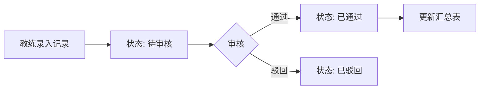

# Conduct（学生奖惩管理）应用

## 📋 功能概述

学生奖惩管理系统，用于记录、审核和统计学生（选手组）的奖惩情况。

## ✨ 核心功能

### 1. 奖惩类型管理（管理员专用）
- ✅ CRUD 奖惩类型（奖励/惩罚）
- ✅ 设置类型对应分值（正数为奖励，负数为惩罚）
- ✅ 启用/停用类型
- ✅ 查看类型使用统计

### 2. 奖惩记录管理
- ✅ 录入奖惩记录（支持附件上传）
- ✅ 三级审核流程（待审核 → 已通过/已驳回）
- ✅ 多维度筛选（学生、类型、状态、日期范围）
- ✅ 仅选手组（GROUP_COMPETITOR）学生可被记录
- ✅ 审核通过后自动更新汇总表

### 3. 奖惩汇总与统计
- ✅ 自动计算每个学生的总分、奖励次数、惩罚次数
- ✅ 排行榜展示（总分降序，前三名显示奖牌）
- ✅ 学生个人奖惩档案
- ✅ 我的奖惩（选手专用快速入口）

## 🗂️ 数据模型

### ConductType（奖惩类型）
| 字段 | 类型 | 说明 |
|------|------|------|
| name | CharField | 类型名称（如：优秀作业、迟到） |
| category | CharField | 分类（REWARD/奖励、PENALTY/惩罚） |
| score | DecimalField | 对应分值（正数为奖，负数为罚） |
| description | TextField | 说明 |
| is_active | BooleanField | 启用状态 |

### ConductRecord（奖惩记录）
| 字段 | 类型 | 说明 |
|------|------|------|
| student | ForeignKey | 学生（仅限选手组） |
| record_type | ForeignKey | 奖惩类型 |
| occurred_date | DateField | 事件发生日期 |
| score | DecimalField | 实际得分（可微调） |
| reason | TextField | 具体原因/描述 |
| attachment | FileField | 附件（可选） |
| status | CharField | 状态（PENDING/待审核、APPROVED/已通过、REJECTED/已驳回） |
| recorded_by | ForeignKey | 记录人 |
| reviewed_by | ForeignKey | 审核人 |
| review_note | TextField | 审核意见 |

### ConductSummary（奖惩汇总）
| 字段 | 类型 | 说明 |
|------|------|------|
| student | OneToOneField | 学生 |
| total_score | DecimalField | 总分（仅统计已通过的记录） |
| reward_count | PositiveIntegerField | 奖励次数 |
| penalty_count | PositiveIntegerField | 惩罚次数 |
| last_updated | DateTimeField | 最后更新时间 |

## 🔐 权限设计

### 自定义权限
```python
# ConductType
- conduct.manage_conduct_types: 管理奖惩类型（增删改）

# ConductRecord
- conduct.add_conduct_record: 录入奖惩记录
- conduct.review_conduct_record: 审核奖惩记录
- conduct.view_all_conduct_records: 查看所有奖惩记录
```

### 角色权限对应
| 角色 | 权限 |
|------|------|
| 管理员 | 所有权限 |
| 教练（GROUP_COACH） | 录入记录、审核记录、查看所有记录 |
| 选手（GROUP_COMPETITOR） | 仅查看自己的记录 |

## 🛣️ URL 路由

```
/conduct/
├── types/                      # 奖惩类型列表
│   ├── create/                # 创建类型
│   ├── <pk>/                  # 类型详情
│   ├── <pk>/update/           # 编辑类型
│   └── <pk>/delete/           # 删除类型
├── records/                    # 奖惩记录列表
│   ├── create/                # 录入记录
│   ├── <pk>/                  # 记录详情
│   ├── <pk>/update/           # 编辑记录（仅待审核）
│   ├── <pk>/delete/           # 删除记录
│   └── <pk>/review/           # 审核记录
├── summary/                    # 排行榜
├── students/<student_id>/      # 学生奖惩档案
└── my/                         # 我的奖惩（选手快速入口）
```

## 📱 菜单导航

```yaml
学生奖惩管理
├── 我的奖惩 (所有登录用户可见)
├── 奖惩记录 (需要 view_conductrecord 权限)
├── 录入记录 (需要 add_conduct_record 权限)
├── 排行榜 (需要 view_conductsummary 权限)
└── 奖惩类型 (需要 manage_conduct_types 权限)
```

## 🔄 工作流程

### 记录录入与审核流程


### 汇总表自动更新机制
- 使用Django信号（post_save、post_delete）监听ConductRecord变化
- 记录审核通过/驳回时自动触发汇总更新
- 记录删除时同步更新汇总

## 🚀 快速开始

### 1. 加载初始数据
```bash
uv run manage.py loaddata conduct/fixtures/default.json
```

初始数据包含8个常用奖惩类型：
- **奖励类型**：优秀作业(+5分)、技能竞赛获奖(+20分)、助人为乐(+3分)、积极参与活动(+2分)
- **惩罚类型**：迟到(-2分)、旷课(-10分)、作业未完成(-3分)、违反纪律(-5分)

### 2. 配置权限
```python
# 为教练组分配权限
coach_group = Group.objects.get(name=GROUP_COACH)
coach_group.permissions.add(
    Permission.objects.get(codename='add_conduct_record'),
    Permission.objects.get(codename='review_conduct_record'),
    Permission.objects.get(codename='view_all_conduct_records'),
)
```

### 3. 运行测试
```bash
uv run manage.py test conduct
```

## 📊 使用示例

### 管理员创建奖惩类型
1. 访问 `/conduct/types/create/`
2. 填写类型信息（注意奖励为正数，惩罚为负数）
3. 保存后类型自动启用

### 教练录入奖惩记录
1. 访问 `/conduct/records/create/`
2. 选择学生（仅显示选手组学生）
3. 选择奖惩类型（自动填充默认分值，可微调）
4. 填写具体原因
5. 上传附件（可选，支持PDF、图片、Word）
6. 提交后进入待审核状态

### 教练审核记录
1. 在记录列表中点击"审核"按钮
2. 选择"通过"或"驳回"
3. 填写审核意见（必填）
4. 提交后自动更新学生汇总

### 选手查看自己的奖惩
1. 访问 `/conduct/my/`
2. 查看总分、奖励/惩罚次数
3. 查看最近20条记录明细

## 📂 文件结构

```
conduct/
├── __init__.py
├── admin.py              # 管理后台配置
├── apps.py               # 应用配置
├── forms.py              # 表单类
├── models.py             # 数据模型
├── tables.py             # django-tables2 表格类
├── tests.py              # 测试用例
├── urls.py               # URL 路由
├── views.py              # 视图类
├── menus.yml             # 菜单配置
├── fixtures/
│   └── default.json      # 初始奖惩类型数据
├── migrations/
│   ├── __init__.py
│   └── 0001_initial.py
└── templates/conduct/
    ├── type_list.html              # 类型列表
    ├── type_form.html              # 类型表单
    ├── type_confirm_delete.html    # 删除确认
    ├── record_list.html            # 记录列表（含筛选）
    ├── record_form.html            # 记录表单
    ├── record_detail.html          # 记录详情
    ├── record_review.html          # 审核表单
    ├── record_confirm_delete.html  # 删除确认
    ├── summary_list.html           # 排行榜
    ├── student_detail.html         # 学生档案
    └── my_conduct.html             # 我的奖惩
```

## 🎨 界面特色

- 使用 DaisyUI 组件库，界面美观统一
- 排行榜前三名显示奖牌图标（🥇🥈🥉）
- 分数使用颜色区分（绿色为正，红色为负）
- 状态使用 badge 显示（待审核/已通过/已驳回）
- 汇总卡片使用渐变背景和统计卡片展示

## 🔧 技术特点

- 遵循 TMS 项目规范
- 使用 `TitleMixin` 自动设置页面标题
- 使用 `StyledFormMixin` 自动添加 DaisyUI 样式
- 使用 `BaseTable` 和 `ActionsColumn` 统一表格样式
- 使用信号自动清理文件和更新汇总
- 完整的权限控制和数据隔离
- 全面的单元测试覆盖

## 📝 注意事项

1. **仅选手组可被记录**：学生必须在 GROUP_COMPETITOR 组中
2. **审核后无法修改**：记录一旦审核通过/驳回，无法再编辑
3. **汇总自动更新**：无需手动维护，通过信号自动同步
4. **附件大小限制**：默认不超过 DEFAULT_UPLOAD_MAX_SIZE_MB
5. **删除级联保护**：奖惩类型被使用后无法删除（PROTECT约束）

## 🧪 测试覆盖

- ✅ 奖惩类型创建（奖励/惩罚）
- ✅ 奖惩记录创建
- ✅ 审核流程触发汇总更新
- ✅ 汇总计算准确性
- ✅ 删除记录后汇总同步

## 📄 License

本应用遵循 TMS 项目的 LICENSE 协议。
